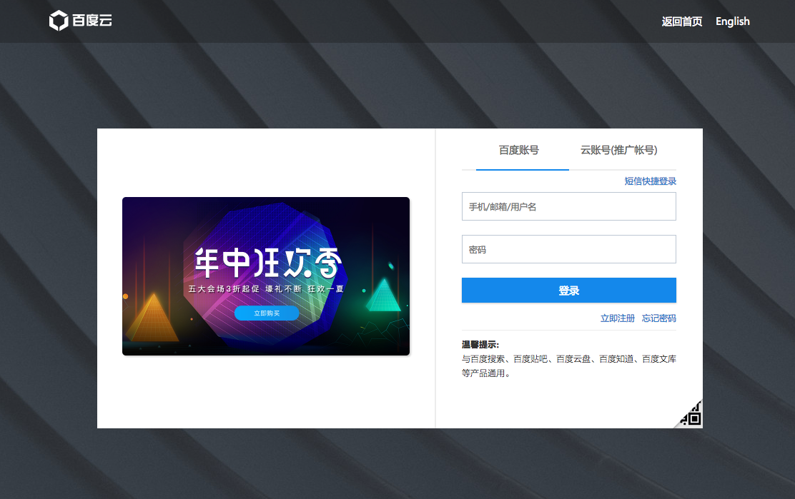
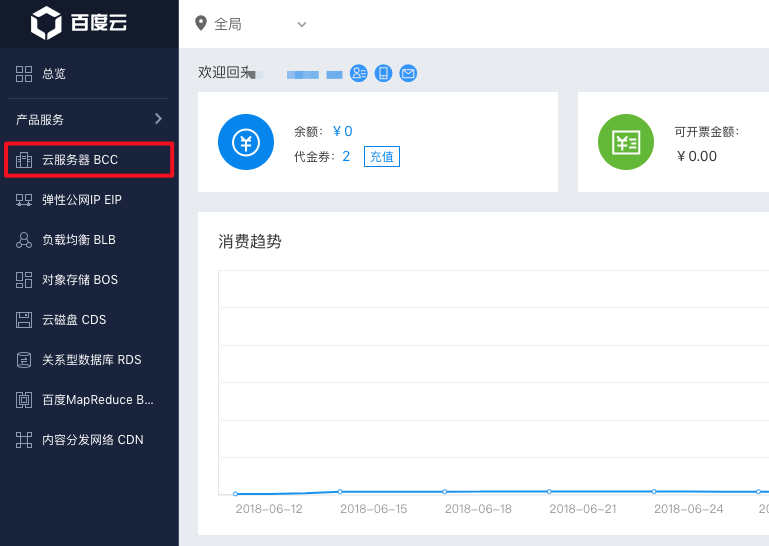
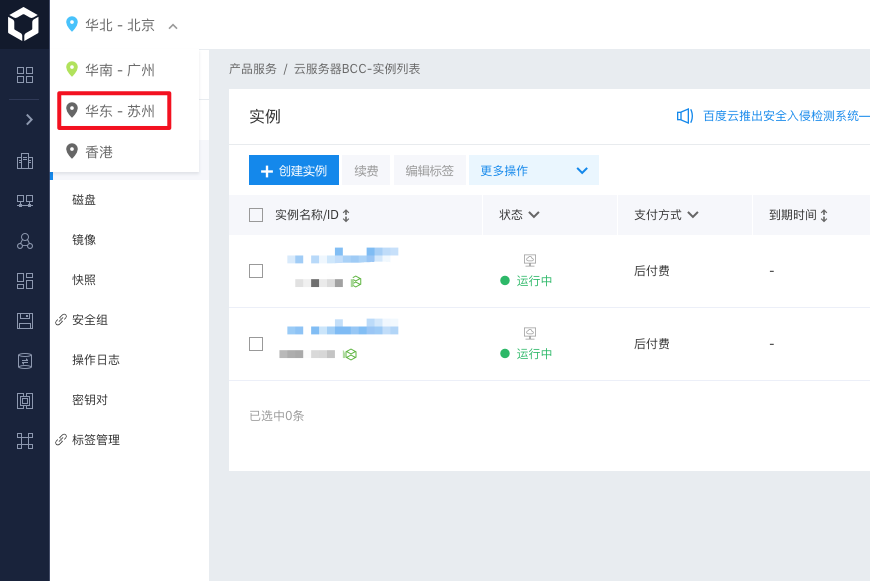
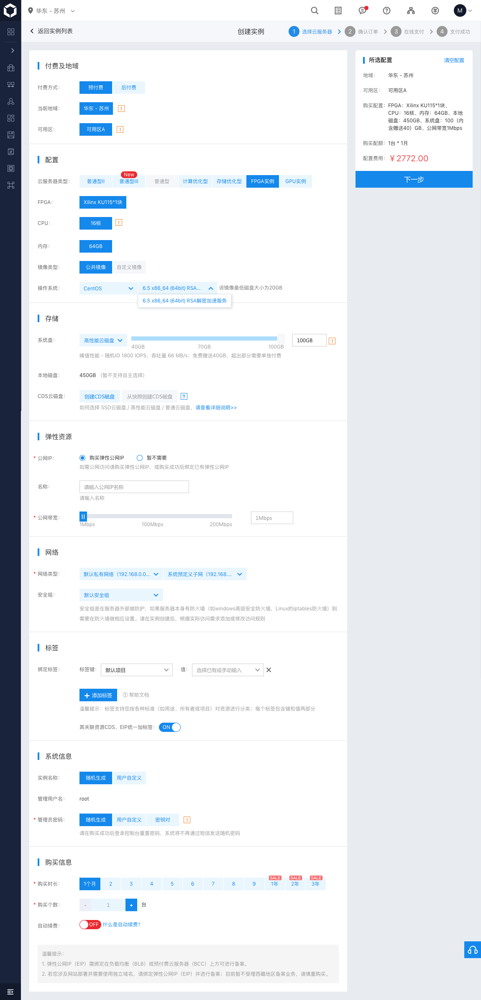
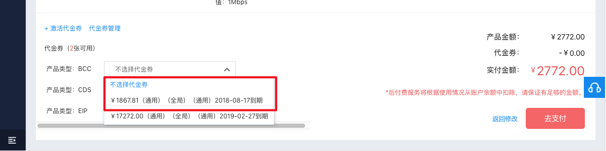
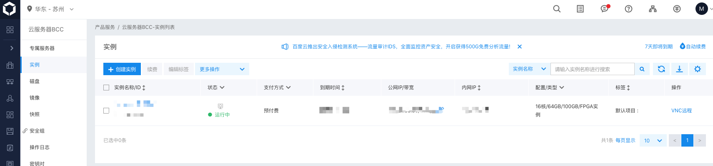
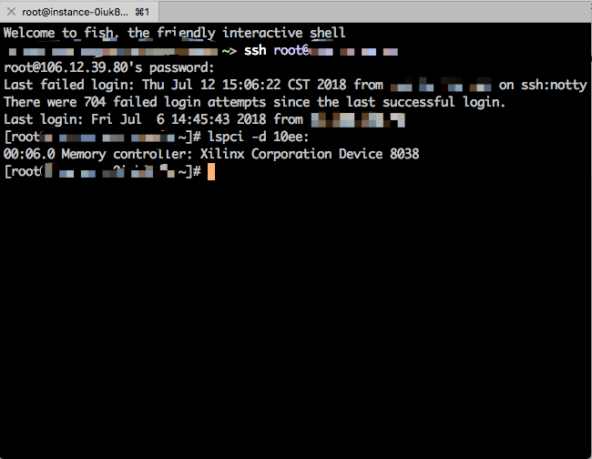
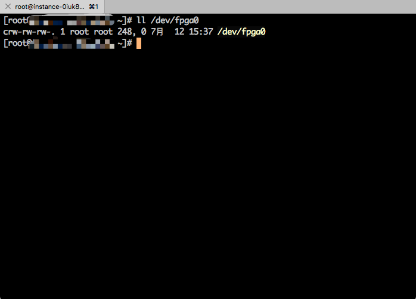

Table of Contents
=================

   * [1. 购买比赛专用AI加速器BCC实例（如已获取BCC实例IP和密码，请跳过此步）](#1-购买比赛专用ai加速器bcc实例如已获取BCC实例IP和密码，请跳过此步)
   * [2. 安装驱动](#2-安装驱动)
   * [3. Polaris编程手册](#3-polaris编程手册)
   * [4. 比赛命题](#4-比赛命题)

# 1. 购买比赛专用AI加速器BCC实例（如已获取BCC实例IP和密码，请跳过此步）

使用百度账号登录[百度云](https://login.bce.baidu.com/?account=)。

选择左侧边栏“云服务器BCC”。

点击左上方下拉列表切换到“华东-苏州”地域。

点击“实例”选项卡中的“创建实例”按钮。

按图示配置购买AI加速器BCC实例，**注意操作系统需选择“6.5 x86_64 (64bit) RSA解密加速服务”**。同时购买一个公网IP，以便于从本地终端连接至购买的BCC实例。如创建实例时选择了“随机生成管理员密码”，则BCC实例的root密码稍后会发送至百度云绑定的手机上。

使用代金券支付产生的费用。

稍等一段时间，可以在“实例”选项卡中看到刚才创建的BCC实例。

使用公网IP和随机密码从本地终端登录至BCC实例，通过`lspci -d 10ee:`可以查看到BCC实例中附带的FPGA。

# 2. 安装驱动

**请维持BCC实例使用的Linux内核版本为`3.10.0-514.16.1.el7.x86_64`，不要使用包管理工具更新内核，否则将导致待安装驱动二进制文件与内核版本不兼容。**
使用`wget --no-check-certificate "https://raw.githubusercontent.com/Cwndmiao/ccf/master/driver/fpga_driver.ko"`命令将编译好的驱动下载至BCC实例，再通过`insmod ./fpga_driver.ko`安装驱动。此时，可以在`/dev`目录下看到驱动成功加载后创建的设备文件`/dev/fpga0`。

# 3. Polaris编程手册

[Polaris编程手册](http://106.12.39.80:8890/)

# 4. 比赛命题
